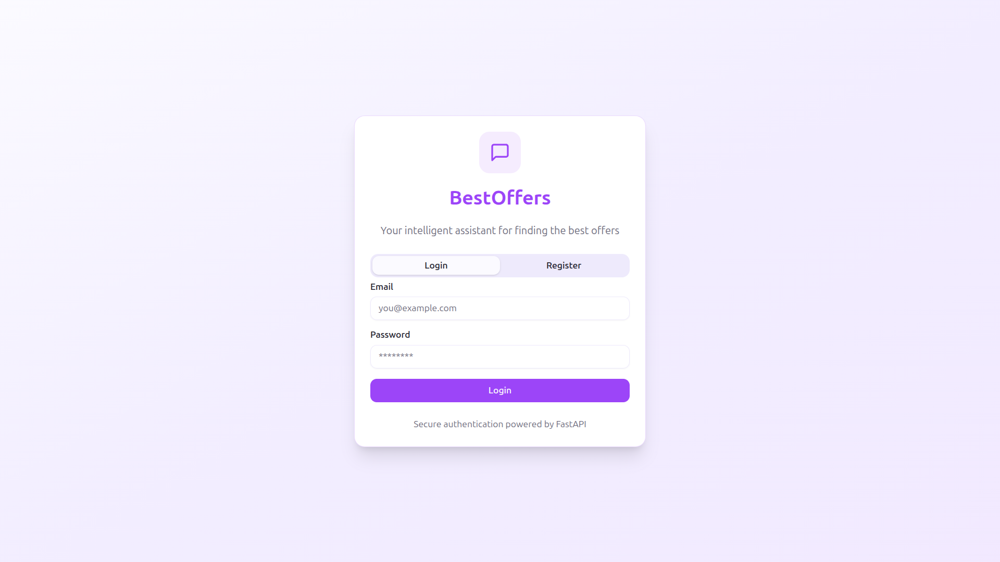
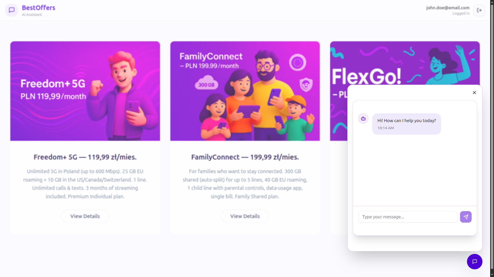
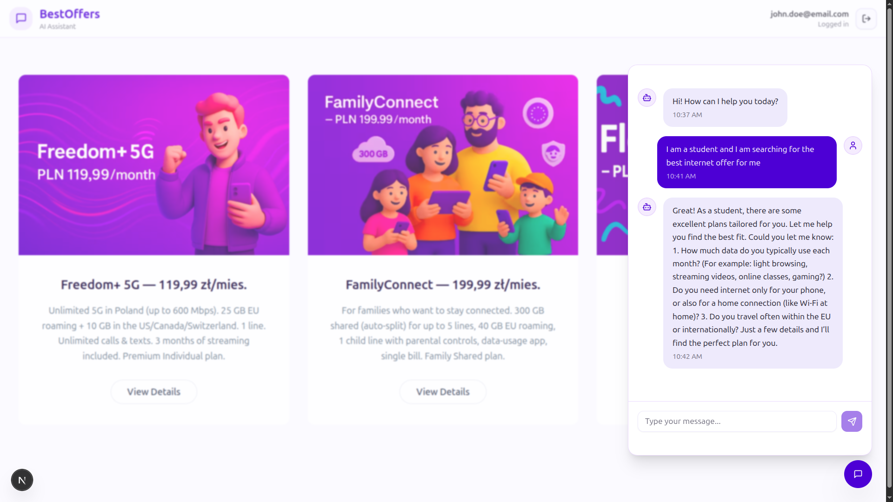

# BestOffers — AI Assistant
> “Turn every chat into a deal.”

Conversational assistant that helps anyone **find the best telecom plan** in seconds—filtering and ranking offers based on needs and budget.

---

## 🤔 Why?
There are too many look-alike offers and too much generic info. Choosing the right plan is hard; people need **personalized guidance** that does the filtering for them.

## 💡 What we built
An **AI chatbot** that proposes the best plan in real time and explains why.
- Chat-style UI: accessible, intuitive, fast
- **RAG (Retrieval-Augmented Generation)** for precise answers about tariffs
- Cloud-hosted and **easy to integrate** into an operator’s web/app

## 🏗️ How it works (high level)
- **Frontend** (web) ↔ **Backend** (API)
- In the cloud (e.g., **Scaleway**):
  - **Qwen** (LLM)
  - **Vector DB** (for RAG)
  - **User/data storage**
- Secure auth (login/sign-up flow in the prototype)
  
## Demo

> Note: This repo contains the hackathon prototype. Real operator data integrations and production-grade deployment are future work.
